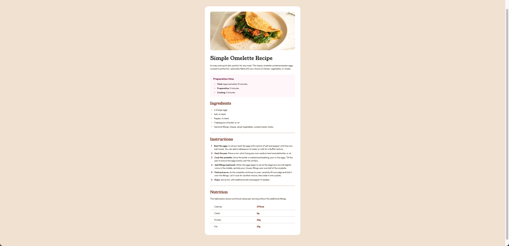

# Frontend Mentor - Recipe page solution

This is a solution to the [Recipe page challenge on Frontend Mentor](https://www.frontendmentor.io/challenges/recipe-page-KiTsR8QQKm).

## Table of contents 目錄

- [Overview 總覽](#overview-總覽)
  - [Screenshot 截圖](#screenshot-截圖)
  - [Links 連結](#links-連結)
- [My process 我的過程](#my-process-我的過程)
  - [Built with 使用技術](#built-with-使用技術)
  - [What I learned 學到的東西](#what-i-learned-學到的東西)
  - [Continued development 持續發展](#continued-development-持續發展)
- [Author 作者](#author-作者)

## Overview 概覽

### Screenshot 截圖



### Links 連結

- Solution URL: [Ahttps://github.com/ylin320/Recipe-page](https://github.com/ylin320/Recipe-page)
- Live Site URL: [https://ylin320.github.io/Recipe-page/](https://ylin320.github.io/Recipe-page/)

## My process 過程

### Built with 使用技術

- Semantic HTML5 markup
- CSS custom properties CSS
- Flexbox
- Mobile-first workflow

### What I learned 學到的東西

During this project, I encountered several significant challenges and learned their solutions:

1. **List Item Text Wrapping**
   Solved the challenge of aligning wrapped text with the first line of text, rather than starting below the bullet point.
   解決列表項目文字換行時需要與第一行文字對齊，而不是從 bullet point 下方開始的問題。

```css
li {
  padding-left: var(--spacing-xs);
  display: table;
  gap: var(--spacing-md);
}

li::before {
  content: "•";
  padding-right: 1rem;
  display: table-cell;
}
```

This solution uses `display: table` and `display: table-cell` to ensure proper text alignment on wrapping, which was a valuable learning experience.
這個解決方案使用 `display: table` 和 `display: table-cell` 來確保文字換行時的對齊，是一個很好的學習經驗。

2. **Nutrition Table Layout**
   Learned how to create a well-structured table layout, including even distribution of labels and values, and the addition of separating lines.
   學習如何建立一個結構良好的表格布局，包括標籤和數值的均勻分配以及分隔線的添加。

```css
.nutrition-table {
  width: 100%;
  border-collapse: collapse;
}

.nutrition-label {
  width: 50%;
  color: var(--color-stone-600);
}

.nutrition-row {
  border-bottom: 1px solid var(--color-stone-150);
}
```

This experience deepened my understanding of table layouts and border applications.
這個經驗讓我更深入理解了表格布局和邊框的應用。

3. **Responsive Design Implementation**
   First time implementing media queries, learning how to adjust layouts for different screen sizes.
   第一次實作 media queries，學習如何根據不同螢幕尺寸調整版面配置。

```css
@media only screen and (max-width: 600px) {
  body {
    padding: 0;
    background: none;
  }

  .card {
    border-radius: 0;
    padding: 0;
  }

  .text-content {
    padding: var(--spacing-2xl) var(--spacing-xl);
  }
}
```

This experience helped me understand the basic principles and implementation of responsive design.
這次的經驗讓我理解了響應式設計的基本原則和實作方法。

### Continued development 持續發展

Based on this learning experience, I plan to focus on the following areas in future projects:

1. Explore more advanced techniques for list styling
   深入研究更多關於清單樣式的進階技巧

2. Learn more complex table layouts and responsive table designs
   學習更複雜的表格布局和響應式表格設計

3. Improve responsive design skills, especially optimization for different devices
   精進響應式設計的技巧，特別是在不同裝置上的最佳化

4. Study more advanced CSS selectors and pseudo-element applications
   研究更多 CSS 的進階選擇器和偽元素的應用

## Author 作者

- GitHub - [@ylin320](https://github.com/ylin320)
- Frontend Mentor - [@ylin320](https://www.frontendmentor.io/profile/ylin320)
